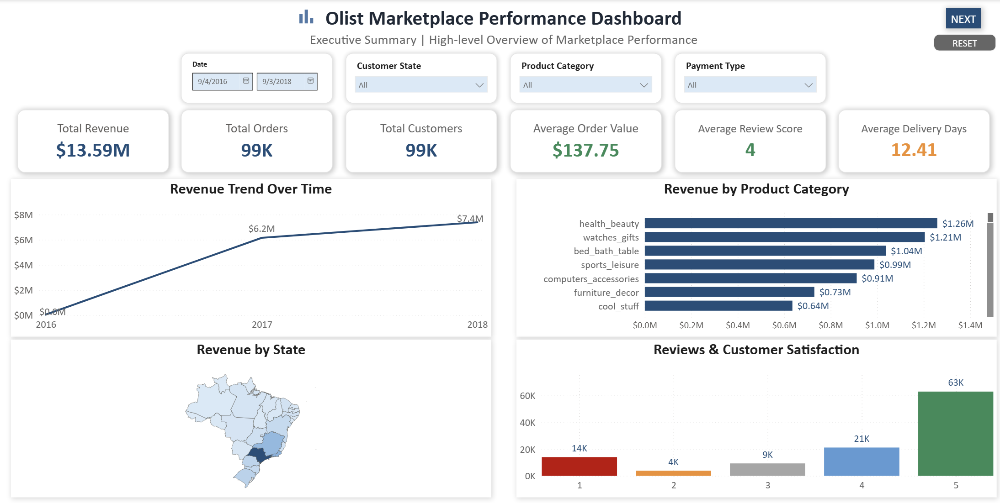
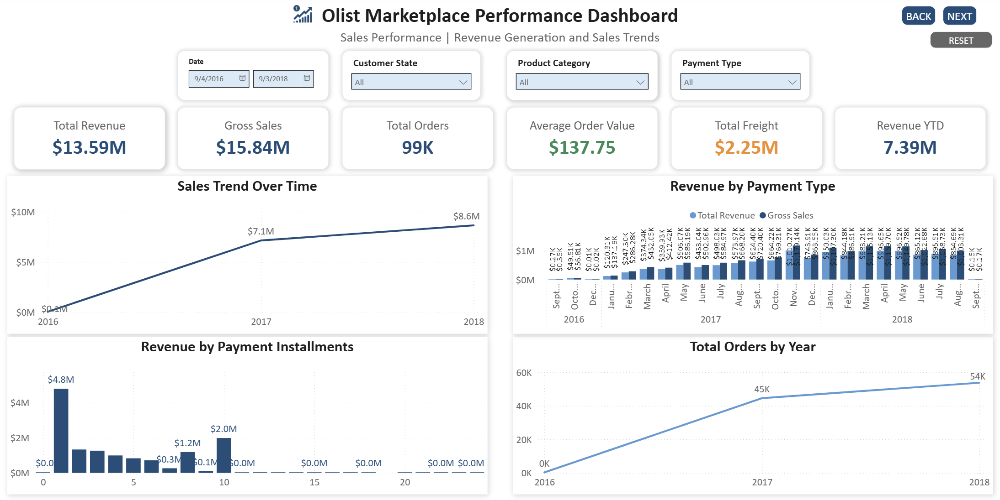
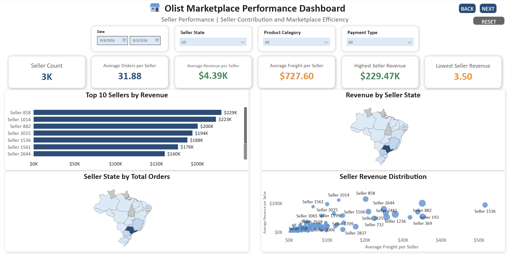

# 🛒 Olist Marketplace Performance Analysis


**Tools:** MySQL · SQL Server · Power BI · Power Query · DAX
**Dataset:** Brazilian E-Commerce Public Dataset by Olist — 1.5M+ records across 9 source files
**Project Type:** Data Engineering · Dimensional Modelling · SQL Analytics · Business Intelligence

End-to-end e-commerce analytics project transforming the Brazilian Olist marketplace dataset through MySQL data engineering and a Kimball-inspired star schema — delivering a five-page Power BI dashboard that analyses sales performance, product and customer behaviour, seller contribution, delivery efficiency, and customer satisfaction.

---

## 📌 Project Overview

This project was designed as a complete BI workflow rather than simply a dashboard build.

The raw Olist dataset contains nine interconnected CSV files representing different business entities and processes. Rather than importing them directly into Power BI, the data was first engineered through MySQL — cleaned, validated, modelled into a star schema, and transformed into analytical reporting views — before being consumed by Power BI for visualisation.

The project demonstrates the full analytical pipeline:

```
Raw CSV Files → MySQL Database → Data Cleaning → Validation
      → Star Schema Design → Model Problem Identified
      → Revised Dimensional Model → SQL Views
      → Power BI Semantic Model → DAX Measures
      → Interactive Dashboard → Business Insights
```

---

## 🎯 Business Problem

The Olist marketplace generates revenue across thousands of sellers, products, and customers spread across Brazilian states. Understanding performance requires analysis across multiple business dimensions simultaneously — sales trends, product contribution, seller efficiency, delivery speed, and customer satisfaction.

This analysis was designed to answer:

> **How is the Olist marketplace performing commercially and operationally — and where are the opportunities to improve revenue, seller efficiency, and customer experience?**

---

## 📊 Dataset Overview

| Attribute | Detail |
|---|---|
| Source | Brazilian E-Commerce Public Dataset by Olist (Kaggle) |
| Records | 1.5M+ across 9 source files |
| Period | September 2016 – September 2018 |
| Scope | Orders, Customers, Products, Sellers, Payments, Reviews, Geolocation |
| Key Metrics | Revenue, Orders, AOV, Freight, Review Score, Delivery Days |

### Source Files
`olist_customers_dataset.csv` · `olist_orders_dataset.csv` · `olist_order_items_dataset.csv` · `olist_order_payments_dataset.csv` · `olist_order_reviews_dataset.csv` · `olist_products_dataset.csv` · `olist_sellers_dataset.csv` · `olist_geolocation_dataset.csv` · `product_category_name_translation.csv`

---

## 🛠️ Technology Stack

| Tool | Purpose |
|---|---|
| MySQL / MySQL Workbench | Database management, data engineering, SQL analysis |
| SQL Server | Star schema redesign and final analytical views |
| SQL | Cleaning, validation, modelling, aggregation, views |
| Power BI Desktop | Business intelligence and dashboard development |
| Power Query | Data preparation within Power BI |
| DAX | Measures and analytical calculations |
| GitHub | Documentation and portfolio presentation |

---

## 🏗️ Data Engineering Approach

### Why SQL First

Power BI can transform data through Power Query — but SQL was deliberately used as the first modelling layer to:

- Understand the underlying relational structure before visualisation
- Establish the correct grain of the analytical data
- Handle one-to-many relationships before loading into Power BI
- Aggregate payment and review data appropriately to prevent row multiplication
- Validate row counts and entity counts
- Create reusable analytical views

This reflects a realistic BI workflow: **database layer → semantic model → reporting layer**, rather than putting the entire transformation burden inside Power BI.

### The Star Schema Problem — and How It Was Fixed

The most important technical challenge in this project was identifying and resolving a **row multiplication problem** in the initial data model.

The Olist dataset contains multiple one-to-many relationships around a single order:

```
One Order
  ├── Multiple Order Items
  ├── Multiple Payment Records
  └── Multiple Review Records
```

Joining these tables directly multiplied fact rows:

```
3 order items × 2 payment records × 2 reviews = 12 rows (instead of 3)
```

This would inflate revenue, freight, and order counts — producing incorrect results.

**The fix:** Aggregate payments and reviews to order level *before* joining to the fact table:

```
Payment Records → Payment Summary (1 row per order) → Fact Sales
Review Records  → Review Summary  (1 row per order) → Fact Sales
```

This produces a clean order-item grain fact table — one row per product within one order.

### Final Star Schema

```
              Dim Customer
                   │
Dim Product ── Fact Sales ── Dim Seller
                   │
               Dim Date
```

---

## 📑 Dashboard Structure

| Page | Title | Focus |
|---|---|---|
| 01 | Executive Summary | Overall revenue, category performance, reviews, geographic distribution |
| 02 | Sales Performance | Gross sales, payment types, installments, order trends |
| 03 | Product & Customer Insights | Top products, category orders, customer spend by state, AOV by category |
| 04 | Seller Performance | Top sellers, seller geography, revenue distribution |
| 05 | Delivery & Customer Experience | Delivery days, review scores, category and state analysis |
| Scenarios | Interactive Scenario Analysis | Two cross-filter scenarios: problem investigation vs performance investigation |

---

## 🔎 Key Findings

| Finding | Detail |
|---|---|
| Total Revenue | $13.59M across 99K orders (Sept 2016 – Sept 2018) |
| Revenue Growth | Grew from $0.0M (2016) to $7.4M by end of 2018 — consistent upward trend |
| Top Category | health_beauty at $1.26M — watches_gifts close behind at $1.21M |
| Average Order Value | $137.75 across all orders |
| Customer Satisfaction | Average review score of 4/5 — 56.55% of reviews are five-star |
| One-Star Reviews | 14K one-star reviews (12.6%) — a meaningful dissatisfaction signal |
| Delivery Performance | Average delivery time of 12.41 days |
| Payment Behaviour | Single-instalment orders ($4.8M) dominate — 10-instalment orders spike at $2.0M |
| Top Seller | Seller 858 at $229K — top 10 sellers show significant revenue concentration |
| Seller Efficiency | Average revenue per seller $4.39K on average 31.88 orders per seller |
| Computers AOV | Highest average order value category at $1,231.84 — 2x the next category |
| Scenario Analysis | Two cross-filter scenarios reveal that delivery speed alone doesn't explain dissatisfaction — product/expectation issues matter too |
| Best Practice Segment | health_beauty · São Paulo · credit card · high reviews = 7.65 day avg delivery, 78.85% five-star rate, growing revenue |

---

## 📸 Dashboard Preview

### Executive Summary


### Sales Performance


### Product & Customer Insights


### Seller Performance


### Delivery & Customer Experience


### Scenario 1 — Problem Investigation (bed_bath_table · 1–2 star reviews)


### Scenario 2 — Performance Investigation (health_beauty · 4–5 star reviews)


---

This analysis reveals that Olist's marketplace is growing commercially but faces operational and experience challenges that require attention.

Key opportunities identified:

- **Revenue concentration risk** — health_beauty and watches_gifts dominate; category diversification would reduce dependency
- **Delivery speed improvement** — 12.41 average delivery days with office_furniture at 20.8 days; faster delivery directly correlates with higher satisfaction
- **One-star review reduction** — 14K one-star reviews (12.6%) represent a significant churn risk; identifying the delivery and product drivers behind them is a priority
- **Seller performance gap** — top seller generates $229K vs lowest at $3.50; understanding what drives top-seller success could lift the long tail
- **Payment instalment opportunity** — the spike at 10 instalments ($2.0M) suggests demand for longer payment terms; expanding instalment options could increase AOV
- **Computer category leverage** — highest AOV at $1,231.84 with relatively low order volume; targeted marketing could significantly increase contribution

> *"Effective BI analysis begins long before the dashboard. The dashboard is only the visible layer of a much larger workflow: Data Engineering → Data Quality → Data Modelling → SQL Analysis → Reporting Layer → Business Intelligence."*

> *"Effective BI analysis begins long before the dashboard. The dashboard is only the visible layer of a much larger workflow: Data Engineering → Data Quality → Data Modelling → SQL Analysis → Reporting Layer → Business Intelligence."*

---

## 🧩 DAX Measures (Key Examples)

```dax
Total Revenue = SUM('Fact Sales'[total_sale_amount])

Total Orders = DISTINCTCOUNT('Fact Sales'[order_id])

Average Review Score = AVERAGE('Fact Sales'[review_score])

Five Star Review Rate = DIVIDE([Five Star Reviews], [Total Reviews])

Average Delivery Days = AVERAGE('Fact Sales'[delivery_days])

Revenue YTD = TOTALYTD([Total Revenue], 'Dim Date'[Date])
```

---

## 📁 Repository Structure

```text
olist-marketplace-performance/
│
├── README.md
│
├── SQL/
│   ├── 01_database_setup.sql
│   ├── 02_data_import.sql
│   ├── 03_data_cleaning.sql
│   ├── 04_data_validation.sql
│   ├── 05_initial_model.sql
│   ├── 06_payment_review_aggregation.sql
│   ├── 07_final_fact_sales.sql
│   ├── 08_dimensions.sql
│   ├── 09_validation_queries.sql
│   └── olist_ecommerce_clean_database.sql
│
├── Assets/
│   ├── cover/
│   │   └── cover.svg
│   └── screenshots/
│       ├── executive-summary/
│       ├── sales-performance/
│       ├── product-customer-insights/
│       ├── seller-performance/
│       ├── delivery-experience/
│       └── scenarios/
│
├── Documentation/
│   ├── Olist_Marketplace_Performance_Report.md
│   ├── Data_Model.md
│   ├── DAX_Measures.md
│   └── Business_Insights.md
│
└── PowerBI/
    └── Olist_Marketplace_Performance.pbix
```

---

## 📖 Full Documentation

📖 **[View Full Analysis Report](Documentation/Olist-Marketplace-Performance-Report.md)**

---

## 👤 Author

**Isaac Olatunji**
Business Intelligence Analyst focused on transforming data into actionable business insights through SQL, Power BI, Excel, and data storytelling.

🔗 GitHub: [isaactheanalyst](https://github.com/isaactheanalyst)
🔗 LinkedIn: [olatunjiisaac](https://www.linkedin.com/in/olatunjiisaac)
